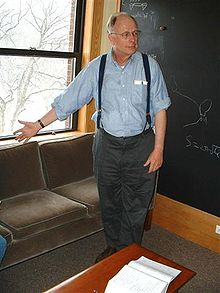

<table class="infobox biography vcard">
<tbody>
<tr>
<th colspan="2">

James B. Hartle

</th>
</tr>
<tr>
<td colspan="2">

Jim Hartle at Harvard University.

</td>
</tr>
<tr>
<th scope="row">Born</th>
<td>

James Burkett Hartle

 20 August 1939&nbsp;(age&nbsp;80) 

<a title="Baltimore" href="https://en.wikipedia.org/wiki/Baltimore">Baltimore</a>,&nbsp;<a title="Maryland" href="https://en.wikipedia.org/wiki/Maryland">Maryland</a>, U.S.

</td>
</tr>
<tr>
<th scope="row">Nationality</th>
<td class="category">American</td>
</tr>
<tr>
<th scope="row">Citizenship</th>
<td class="category">United States</td>
</tr>
<tr>
<th scope="row">Alma&nbsp;mater</th>
<td><a title="California Institute of Technology" href="https://en.wikipedia.org/wiki/California_Institute_of_Technology">California Institute of Technology</a></td>
</tr>
<tr>
<th scope="row">Known&nbsp;for</th>
<td><a title="Consistent histories" href="https://en.wikipedia.org/wiki/Consistent_histories">Consistent histories</a></td>
</tr>
<tr>
<td colspan="2"><strong>Scientific career</strong></td>
</tr>
<tr>
<th scope="row">Fields</th>
<td class="category"><a title="General relativity" href="https://en.wikipedia.org/wiki/General_relativity">General relativity</a> <a title="Astrophysics" href="https://en.wikipedia.org/wiki/Astrophysics">Astrophysics</a> <a title="Quantum mechanics" href="https://en.wikipedia.org/wiki/Quantum_mechanics">Quantum mechanics</a></td>
</tr>
<tr>
<th scope="row">Institutions</th>
<td><a title="University of California, Santa Barbara" href="https://en.wikipedia.org/wiki/University_of_California,_Santa_Barbara">University of California, Santa Barbara</a> <a title="Santa Fe Institute" href="https://en.wikipedia.org/wiki/Santa_Fe_Institute">Santa Fe Institute</a></td>
</tr>
</tbody>
</table>
 

<strong>James Burkett Hartle</strong>&nbsp;(August 20, 1939) is an American&nbsp;<a title="Physicist" href="https://en.wikipedia.org/wiki/Physicist">physicist</a>. He has been a professor of physics at the&nbsp;<a title="University of California, Santa Barbara" href="https://en.wikipedia.org/wiki/University_of_California,_Santa_Barbara">University of California, Santa Barbara</a>&nbsp;since 1966, and he is currently a member of the external faculty of the&nbsp;<a title="Santa Fe Institute" href="https://en.wikipedia.org/wiki/Santa_Fe_Institute">Santa Fe Institute</a>. Hartle is known for his work in&nbsp;<a title="General relativity" href="https://en.wikipedia.org/wiki/General_relativity">general relativity</a>,&nbsp;<a title="Astrophysics" href="https://en.wikipedia.org/wiki/Astrophysics">astrophysics</a>, and&nbsp;<a class="mw-redirect" title="Interpretation of quantum mechanics" href="https://en.wikipedia.org/wiki/Interpretation_of_quantum_mechanics">interpretation of quantum mechanics</a>.

 

<h2> Publications</h2>

<ul>

                             

 <li><a target="_blank" href="https://github.com/manjunath5496/James-Hartle-Publications/blob/master/jah(1).pdf" style="text-decoration:none;">Are We Typical?</a></li>

 <li><a target="_blank" href="https://github.com/manjunath5496/James-Hartle-Publications/blob/master/jah(2).pdf" style="text-decoration:none;">The No-Boundary Measure of the Universe</a></li>

<li><a target="_blank" href="https://github.com/manjunath5496/James-Hartle-Publications/blob/master/jah(3).pdf" style="text-decoration:none;">Quantum Mechanics with Extended Probabilities</a></li>
 <li><a target="_blank" href="https://github.com/manjunath5496/James-Hartle-Publications/blob/master/jah(4).pdf" style="text-decoration:none;">The Classical Universes of the
No-Boundary Quantum State </a></li>                              
<li><a target="_blank" href="https://github.com/manjunath5496/James-Hartle-Publications/blob/master/jah(5).pdf" style="text-decoration:none;">The quasiclassical realms of this quantum universe </a></li>
<li><a target="_blank" href="https://github.com/manjunath5496/James-Hartle-Publications/blob/master/jah(6).pdf" style="text-decoration:none;">Replication Regulates Volume Weighting in Quantum Cosmology</a></li>
 <li><a target="_blank" href="https://github.com/manjunath5496/James-Hartle-Publications/blob/master/jah(7).pdf" style="text-decoration:none;">Science in a Very Large Universe</a></li>

 <li><a target="_blank" href="https://github.com/manjunath5496/James-Hartle-Publications/blob/master/jah(8).pdf" style="text-decoration:none;"> The No-Boundary Measure in the Regime of Eternal Inflation </a></li>
   <li><a target="_blank" href="https://github.com/manjunath5496/James-Hartle-Publications/blob/master/jah(9).pdf" style="text-decoration:none;">The Xerographic Distribution:
Scientific Reasoning in a Large Universea</a></li>
  
   
 <li><a target="_blank" href="https://github.com/manjunath5496/James-Hartle-Publications/blob/master/jah(10).pdf" style="text-decoration:none;">Local Observation in Eternal inflation</a></li>                              
<li><a target="_blank" href="https://github.com/manjunath5496/James-Hartle-Publications/blob/master/jah(11).pdf" style="text-decoration:none;">Arrows of time in the bouncing universes of the no-boundary quantum state</a></li>
<li><a target="_blank" href="https://github.com/manjunath5496/James-Hartle-Publications/blob/master/jah(12).pdf" style="text-decoration:none;">Decoherent Histories Quantum Mechanics with One "Real" Fine-Grained History</a></li>
<li><a target="_blank" href="https://github.com/manjunath5496/James-Hartle-Publications/blob/master/jah(13).pdf" style="text-decoration:none;">Holographic No-Boundary Measure</a></li>

<li><a target="_blank" href="https://github.com/manjunath5496/James-Hartle-Publications/blob/master/jah(14).pdf" style="text-decoration:none;">Accelerated Expansion from Negative &#581;</a></li>
                              
<li><a target="_blank" href="https://github.com/manjunath5496/James-Hartle-Publications/blob/master/jah(15).pdf" style="text-decoration:none;">Quantum Probabilities for Inflation from Holography</a></li>

<li><a target="_blank" href="https://github.com/manjunath5496/James-Hartle-Publications/blob/master/jah(16).pdf" style="text-decoration:none;">The Quantum Mechanical Arrows of Time </a></li>

  <li><a target="_blank" href="https://github.com/manjunath5496/James-Hartle-Publications/blob/master/jah(17).pdf" style="text-decoration:none;">Vector Fields in Holographic Cosmology</a></li>   
  
<li><a target="_blank" href="https://github.com/manjunath5496/James-Hartle-Publications/blob/master/jah(18).pdf" style="text-decoration:none;">Anthropic Bounds on &#581;
from the No-Boundary Quantum State</a></li> 

  
<li><a target="_blank" href="https://github.com/manjunath5496/James-Hartle-Publications/blob/master/jah(19).pdf" style="text-decoration:none;">Adaptive Coarse Graining, Environment, Strong Decoherence, and Quasiclassical Realms</a></li> 

<li><a target="_blank" href="https://github.com/manjunath5496/James-Hartle-Publications/blob/master/jah(20).pdf" style="text-decoration:none;">Quantum Transitions Between Classical Histories</a></li>

<li><a target="_blank" href="https://github.com/manjunath5496/James-Hartle-Publications/blob/master/jah(21).pdf" style="text-decoration:none;">The Observer Strikes Back</a></li>
<li><a target="_blank" href="https://github.com/manjunath5496/James-Hartle-Publications/blob/master/jah(22).pdf" style="text-decoration:none;">Murray Gell-Mann: A Short Appreciation</a></li> 
 <li><a target="_blank" href="https://github.com/manjunath5496/James-Hartle-Publications/blob/master/jah(23).pdf" style="text-decoration:none;">Living in a Superposition </a></li> 
 

   <li><a target="_blank" href="https://github.com/manjunath5496/James-Hartle-Publications/blob/master/jah(24).pdf" style="text-decoration:none;">One Bubble to Rule Them All</a></li>
 
   <li><a target="_blank" href="https://github.com/manjunath5496/James-Hartle-Publications/blob/master/jah(25).pdf" style="text-decoration:none;">Decoherent Histories Quantum Mechanics: Starting with Records of What Happens</a></li>                              
 <li><a target="_blank" href="https://github.com/manjunath5496/James-Hartle-Publications/blob/master/jah(26).pdf" style="text-decoration:none;">Why Our Universe Is Comprehensible </a></li>
 <li><a target="_blank" href="https://github.com/manjunath5496/James-Hartle-Publications/blob/master/jah(27).pdf" style="text-decoration:none;">Observational Implications of Fuzzball Formation</a></li>
   
 
   <li><a target="_blank" href="https://github.com/manjunath5496/James-Hartle-Publications/blob/master/jah(28).pdf" style="text-decoration:none;">The Real No-Boundary Wave Function in Lorentzian Quantum Cosmology</a></li>
 
   <li><a target="_blank" href="https://github.com/manjunath5496/James-Hartle-Publications/blob/master/jah(29).pdf" style="text-decoration:none;">Working With Stephen </a></li>                              

  <li><a target="_blank" href="https://github.com/manjunath5496/James-Hartle-Publications/blob/master/jah(30).pdf" style="text-decoration:none;">Quantum Multiverses </a></li>
 
   <li><a target="_blank" href="https://github.com/manjunath5496/James-Hartle-Publications/blob/master/jah(31).pdf" style="text-decoration:none;">QUANTUM MECHANICS IN THE LIGHT OF QUANTUM COSMOLOGY</a></li> 
    <li><a target="_blank" href="https://github.com/manjunath5496/James-Hartle-Publications/blob/master/jah(32).pdf" style="text-decoration:none;">Stephen Hawking: To Understand the Universe </a></li> 

   <li><a target="_blank" href="https://github.com/manjunath5496/James-Hartle-Publications/blob/master/jah(33).pdf" style="text-decoration:none;">Damped perturbations in the no-boundary state</a></li>                              

  <li><a target="_blank" href="https://github.com/manjunath5496/James-Hartle-Publications/blob/master/jah(34).pdf" style="text-decoration:none;">Stephen Hawking (1942-2018)
Towards a Complete Understanding of the Universe</a></li> 
 
  <li><a target="_blank" href="https://github.com/manjunath5496/James-Hartle-Publications/blob/master/jah(35).pdf" style="text-decoration:none;">A Few Recollections of Stephen</a></li> 

  <li><a target="_blank" href="https://github.com/manjunath5496/James-Hartle-Publications/blob/master/jah(36).pdf" style="text-decoration:none;">THE QUANTUM MECHANICS OF COSMOLOGY</a></li> 
 
<li><a target="_blank" href="https://github.com/manjunath5496/James-Hartle-Publications/blob/master/jah(37).pdf" style="text-decoration:none;">Computability and Physical Theories</a></li>
 <li><a target="_blank" href="https://github.com/manjunath5496/James-Hartle-Publications/blob/master/jah(38).pdf" style="text-decoration:none;">Essays</a></li>
<li><a target="_blank" href="https://github.com/manjunath5496/James-Hartle-Publications/blob/master/jah(39).pdf" style="text-decoration:none;">What is the No-Boundary Wave Function of the Universe?</a></li>
 <li><a target="_blank" href="https://github.com/manjunath5496/James-Hartle-Publications/blob/master/jah(40).pdf" style="text-decoration:none;">The Impact of Cosmology on Quantum Mechanics </a></li>                              
<li><a target="_blank" href="https://github.com/manjunath5496/James-Hartle-Publications/blob/master/jah(41).pdf" style="text-decoration:none;">Alternative Decohering Histories in Quantum Mechanics</a></li>
<li><a target="_blank" href="https://github.com/manjunath5496/James-Hartle-Publications/blob/master/jah(42).pdf" style="text-decoration:none;">Quantum Mechanics of Individual Systems</a></li>
 
  <li><a target="_blank" href="https://github.com/manjunath5496/James-Hartle-Publications/blob/master/jah(43).pdf" style="text-decoration:none;">How Nature is Conformable to Herself: A View from Quantum Cosmology</a></li>
 <li><a target="_blank" href="https://github.com/manjunath5496/James-Hartle-Publications/blob/master/jah(44).pdf" style="text-decoration:none;">Stephen William Hawking CH CBE
8 January 1942 – 14 March 2018 Elected FRS 1974</a></li>
   <li><a target="_blank" href="https://github.com/manjunath5496/James-Hartle-Publications/blob/master/jah(45).pdf" style="text-decoration:none;">Arrows of Time and
Initial and Final Conditions in the Quantum Mechanics of Closed Systems Like the Universe</a></li>  
   
<li><a target="_blank" href="https://github.com/manjunath5496/James-Hartle-Publications/blob/master/jah(46).pdf" style="text-decoration:none;">The Conformal Rotation in Linearised Gravity</a></li> 
                             
<li><a target="_blank" href="https://github.com/manjunath5496/James-Hartle-Publications/blob/master/jah(47).pdf" style="text-decoration:none;">Gravitational instantons, extra dimensions and form fields </a></li>
<li><a target="_blank" href="https://github.com/manjunath5496/James-Hartle-Publications/blob/master/jah(48).pdf" style="text-decoration:none;">The State of the Universe</a></li>

<li><a target="_blank" href="https://github.com/manjunath5496/James-Hartle-Publications/blob/master/jah(49).pdf" style="text-decoration:none;">Theories of Everything and Hawking's Wave Function of the Universe </a></li>
                              
<li><a target="_blank" href="https://github.com/manjunath5496/James-Hartle-Publications/blob/master/jah(50).pdf" style="text-decoration:none;">Bohmian Histories and Decoherent Histories</a></li>
<li><a target="_blank" href="https://github.com/manjunath5496/James-Hartle-Publications/blob/master/jah(51).pdf" style="text-decoration:none;">What Connects Different Interpretations of Quantum Mechanics?</a></li>
<li><a target="_blank" href="https://github.com/manjunath5496/James-Hartle-Publications/blob/master/jah(52).pdf" style="text-decoration:none;">Generalized Quantum Theory
of Recollapsing Homogeneous Cosmologies</a></li>

<li><a target="_blank" href="https://github.com/manjunath5496/James-Hartle-Publications/blob/master/jah(53).pdf" style="text-decoration:none;">Linear Positivity and Virtual Probability</a></li>
 
<li><a target="_blank" href="https://github.com/manjunath5496/James-Hartle-Publications/blob/master/jah(54).pdf" style="text-decoration:none;">The Physics of 'Now' </a></li>

<li><a target="_blank" href="https://github.com/manjunath5496/James-Hartle-Publications/blob/master/jah(55).pdf" style="text-decoration:none;">Anthropic Reasoning and Quantum Cosmology</a></li>
 
  <li><a target="_blank" href="https://github.com/manjunath5496/James-Hartle-Publications/blob/master/jah(56).pdf" style="text-decoration:none;">Representations of Spacetime Alternatives and Their Classical Limits </a></li>                              

  <li><a target="_blank" href="https://github.com/manjunath5496/James-Hartle-Publications/blob/master/jah(57).pdf" style="text-decoration:none;">General Relativity in the
Undergraduate Physics Curriculum</a></li>
 
   <li><a target="_blank" href="https://github.com/manjunath5496/James-Hartle-Publications/blob/master/jah(58).pdf" style="text-decoration:none;">Excess Baggage</a></li>
    <li><a target="_blank" href="https://github.com/manjunath5496/James-Hartle-Publications/blob/master/jah(59).pdf" style="text-decoration:none;">Generalizing Quantum Mechanics for Quantum Gravity</a></li>
 
  <li><a target="_blank" href="https://github.com/manjunath5496/James-Hartle-Publications/blob/master/jah(60).pdf" style="text-decoration:none;">Observables in effective gravity</a></li>
 
   <li><a target="_blank" href="https://github.com/manjunath5496/James-Hartle-Publications/blob/master/jah(61).pdf" style="text-decoration:none;">Generalizing Quantum Mechanics
for Quantum Spacetime </a></li>
 
   <li><a target="_blank" href="https://github.com/manjunath5496/James-Hartle-Publications/blob/master/jah(62).pdf" style="text-decoration:none;">Quasi classical Coarse Graining
and Thermodynamic Entropy</a></li>
 
   <li><a target="_blank" href="https://github.com/manjunath5496/James-Hartle-Publications/blob/master/jah(63).pdf" style="text-decoration:none;">Quantum Physics and Human Language</a></li>                              

  <li><a target="_blank" href="https://github.com/manjunath5496/James-Hartle-Publications/blob/master/jah(64).pdf" style="text-decoration:none;">THE SPACETIME APPROACH TO QUANTUM MECHANICS</a></li>
 
   <li><a target="_blank" href="https://github.com/manjunath5496/James-Hartle-Publications/blob/master/jah(65).pdf" style="text-decoration:none;">THE QUANTUM MECHANICS OF CLOSED SYSTEMS </a></li> 

   <li><a target="_blank" href="https://github.com/manjunath5496/James-Hartle-Publications/blob/master/jah(66).pdf" style="text-decoration:none;">CLASSICAL EQUATIONS FOR QUANTUM SYSTEMS</a></li> 
 
   <li><a target="_blank" href="https://github.com/manjunath5496/James-Hartle-Publications/blob/master/jah(67).pdf" style="text-decoration:none;">The Reduction of the State Vector and Limitations on Measurement in the Quantum Mechanics of Closed Systems</a></li>                              

  <li><a target="_blank" href="https://github.com/manjunath5496/James-Hartle-Publications/blob/master/jah(68).pdf" style="text-decoration:none;">SPACETIME QUANTUM MECHANICS AND THE QUANTUM MECHANICS OF SPACETIME</a></li> 
 
  
   <li><a target="_blank" href="https://github.com/manjunath5496/James-Hartle-Publications/blob/master/jah(69).pdf" style="text-decoration:none;">TIME SYMMETRY AND ASYMMETRY IN
QUANTUM MECHANICS AND QUANTUM COSMOLOGY</a></li>                              

  <li><a target="_blank" href="https://github.com/manjunath5496/James-Hartle-Publications/blob/master/jah(70).pdf" style="text-decoration:none;">Unitarity and Causality in Generalized Quantum Mechanics for Non-Chronal Spacetimes</a></li> 
  
 
 <li><a target="_blank" href="https://github.com/manjunath5496/James-Hartle-Publications/blob/master/jah(71).pdf" style="text-decoration:none;">Equivalent Sets of Histories
and Multiple Quasiclassical Realms</a></li>
 
 <li><a target="_blank" href="https://github.com/manjunath5496/James-Hartle-Publications/blob/master/jah(72).pdf" style="text-decoration:none;">Quasiclassical Realms In A Quantum Universe</a></li> 
 
 
 <li><a target="_blank" href="https://github.com/manjunath5496/James-Hartle-Publications/blob/master/jah(73).pdf" style="text-decoration:none;">Spacetime Information</a></li>
  <li><a target="_blank" href="https://github.com/manjunath5496/James-Hartle-Publications/blob/master/jah(74).pdf" style="text-decoration:none;">Conservation Laws
in the Quantum Mechanics of Closed Systems</a></li>
    <li><a target="_blank" href="https://github.com/manjunath5496/James-Hartle-Publications/blob/master/jah(75).pdf" style="text-decoration:none;">QUANTUM MECHANICS AT THE PLANCK SCALE</a></li>                        
<li><a target="_blank" href="https://github.com/manjunath5496/James-Hartle-Publications/blob/master/jah(76).pdf" style="text-decoration:none;">MATTERS OF GRAVITY </a></li>

  <li><a target="_blank" href="https://github.com/manjunath5496/James-Hartle-Publications/blob/master/jah(77).pdf" style="text-decoration:none;">Time and Time Functions
in Parametrized Non-Relativistic Quantum Mechanics</a></li>
 
   <li><a target="_blank" href="https://github.com/manjunath5496/James-Hartle-Publications/blob/master/jah(78).pdf" style="text-decoration:none;">Strong Decoherence </a></li> 

   <li><a target="_blank" href="https://github.com/manjunath5496/James-Hartle-Publications/blob/master/jah(79).pdf" style="text-decoration:none;">Scientific Knowledge from the
Perspective of Quantum Cosmology</a></li> 
 
   <li><a target="_blank" href="https://github.com/manjunath5496/James-Hartle-Publications/blob/master/jah(80).pdf" style="text-decoration:none;">Nearly Instantaneous Alternatives in Quantum Mechanics</a></li>                              

  <li><a target="_blank" href="https://github.com/manjunath5496/James-Hartle-Publications/blob/master/jah(81).pdf" style="text-decoration:none;">Solutions of the Regge Equations on some Triangulations of CP2</a></li> 
 
  
   <li><a target="_blank" href="https://github.com/manjunath5496/James-Hartle-Publications/blob/master/jah(82).pdf" style="text-decoration:none;">Signature of the Simplicial Supermetric</a></li>                              

  <li><a target="_blank" href="https://github.com/manjunath5496/James-Hartle-Publications/blob/master/jah(83).pdf" style="text-decoration:none;">Quantum Cosmology:
Problems for the 21st Century</a></li> 
  
 
 <li><a target="_blank" href="https://github.com/manjunath5496/James-Hartle-Publications/blob/master/jah(84).pdf" style="text-decoration:none;">Sources of Predictability</a></li>
 
 <li><a target="_blank" href="https://github.com/manjunath5496/James-Hartle-Publications/blob/master/jah(85).pdf" style="text-decoration:none;">Comparing Formulations of Generalized Quantum Mechanics for Reparametrization-Invariant Systems</a></li> 
 
 
 <li><a target="_blank" href="https://github.com/manjunath5496/James-Hartle-Publications/blob/master/jah(86).pdf" style="text-decoration:none;">Generalized Quantum Theory in
Evaporating Black Hole Spacetimes</a></li>
  <li><a target="_blank" href="https://github.com/manjunath5496/James-Hartle-Publications/blob/master/jah(87).pdf" style="text-decoration:none;">Comment on "Consistent Sets Yield Contrary Inferences in Quantum Theory"</a></li>
    <li><a target="_blank" href="https://github.com/manjunath5496/James-Hartle-Publications/blob/master/jah(88).pdf" style="text-decoration:none;">Quantum Pasts and the Utility of History </a></li>                        
<li><a target="_blank" href="https://github.com/manjunath5496/James-Hartle-Publications/blob/master/jah(89).pdf" style="text-decoration:none;">Entropy of Classical Histories </a></li>

  <li><a target="_blank" href="https://github.com/manjunath5496/James-Hartle-Publications/blob/master/jah(90).pdf" style="text-decoration:none;">GENERALIZED QUANTUM THEORY AND BLACK HOLE EVAPORATION</a></li>
    <li><a target="_blank" href="https://github.com/manjunath5496/James-Hartle-Publications/blob/master/jah(91).pdf" style="text-decoration:none;">Classical Dynamics of the
Quantum Harmonic Chain </a></li>                        

</ul>
